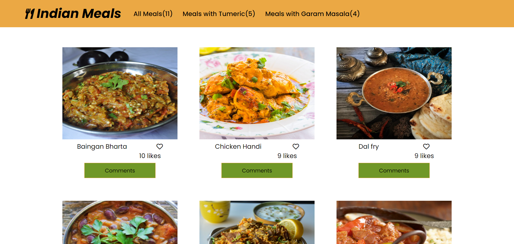
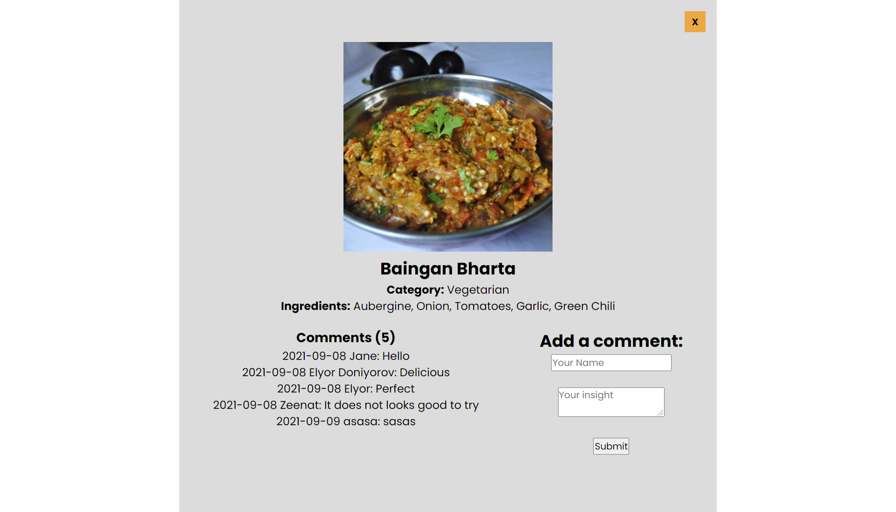

# Indian-Meals
> The JavaScript capstone project is about building a web application based on an external API. We selected an API that provides data about Indian meals and then built the web app around it. The web app has 2 user interfaces, the homepage and a popup window with more data about a meal that which also allows you to comment on it.

### Homepage

### Popup window

> Two APIs were used for the web app: The [Meals DB API](https://www.themealdb.com/api.php) and the [Involvement API](https://www.notion.so/microverse/Involvement-API-869e60b5ad104603aa6db59e08150270) from Microverse. The meals API was used to retrieve and display details for Indian meals and the involvement API was used to record and display likes and comments for each meal.

## Built With

- HTML
- CSS
- JavaScript(ES6)
- Webpack
- Jest Library

## Live demo

[Live demo link](https://zeenatlawal.github.io/Indian-Meals/dist/)

## Getting Started

### To get a local copy run the following steps:

- [Copy this link](https://github.com/ZeenatLawal/Indian-Meals.git)
- Open your terminal or command line
- Run `git clone` and paste the link
- Open the folder with your code editor
- Create a branch to work on
- Run `npm install`
- Run `npm run build`
- Run `npm run start` to launch the server.
- Run `npm run test` to run the test cases.

## Authors

👤 **Zeenat Lawal**

- GitHub: [@ZeenatLawal](https://github.com/ZeenatLawal)
- Twitter: [@lawal_zeenat](https://twitter.com/lawal_zeenat)
- LinkedIn: [Zeenat Lawal](https://www.linkedin.com/in/zeenatlawal/)

👤 **Elyor Doniyorov**

- Github: [@elyor-doniyorov](https://github.com/elyor-doniyorov)
- LinkedIn: [@elyor-doniyorov](www.linkedin.com/in/elyor-doniyorov)

## 🤝 Contributing

Contributions, issues, and feature requests are welcome!

Feel free to check the [issues page](https://github.com/ZeenatLawal/Indian-Meals/issues).

## Show your support

Give a ⭐️ if you like this project!

## Acknowledgments

- Learning partners, Standup and morning session team